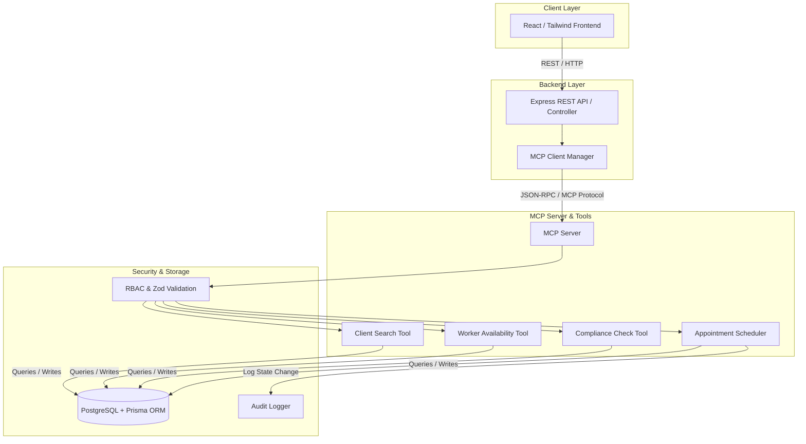
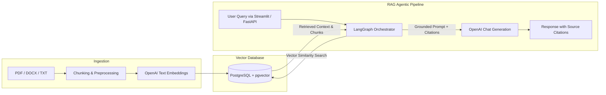

# Hi there, I'm Charlie Qi 👋

---

### 🎓 About Me

I am a **Master of Computer Science graduate (AI Specialisation)** from **Monash University** (*High Distinction Average*, **1st in Class** in *Machine Learning*, *Computer Vision*, and *Applied Practice 1*).

I bridge modern **AI Engineering, Full-Stack Development (Python & TypeScript), and RAG/Agentic Workflows** with **10 years of full-time industry experience** in Biotech/Nutrition product R&D and Technical Management (Bellamy's Organic, Fonterra, Bega Cheese).

- 🚀 **Focus Areas**: Model Context Protocol (MCP), Agentic Workflows, RAG Pipelines, Full-Stack Web Apps, PostgreSQL / pgvector.
- 💡 **Domain Advantage**: Expertise in complex regulatory systems, technical documentation, process automation, and cross-functional leadership.

---

### 🛠️ Technical Skills

| Domain | Technologies & Frameworks |
| :--- | :--- |
| **Languages** | Python, TypeScript, JavaScript, SQL, HTML/CSS, VBA |
| **Software / Full-Stack** | Node.js, Express, FastAPI, Streamlit, React, Prisma, REST APIs, Vitest / pytest |
| **AI / MCP / RAG** | Model Context Protocol (MCP), LangGraph, Vector Search (pgvector), Grounded Generation, Citations, RAGAS Eval |
| **ML / NLP / CV** | PyTorch, TensorFlow / Keras, scikit-learn, CNNs, LSTMs, Seq2Seq + Attention, Semantic Segmentation |
| **Data & Databases** | PostgreSQL, pgvector, SQLAlchemy, Prisma ORM, SQLite, pandas, NumPy, Relational Modelling |
| **DevOps & Security** | Docker, Docker Compose, GitHub Actions, PKI (X.509, RSA, AES), Zod Validation, RBAC, Audit Logging |

---

### 🌟 Featured Projects & System Architecture

#### 1. 🤖 [CareOps AI — MCP-Powered Aged Care Operations Assistant](https://github.com/Charlie-Qi394/careops-ai)
> **Stack**: TypeScript, Node.js, Express, React, PostgreSQL, Prisma, MCP, Docker, GitHub Actions

A production-style AI operations platform designed for aged-care operational workflows. Features an isolated Model Context Protocol (MCP) server providing secure tools for client lookup, worker availability, compliance verification, address updates, and appointment scheduling with strict Role-Based Access Control (RBAC), Zod schema validation, confirmation-gated writes, and structured audit logs.

---

#### 2. 📚 [AI Regulatory Knowledge Assistant](https://github.com/Charlie-Qi394/ai-regulatory-knowledge-assistant)
> **Stack**: Python, FastAPI, Streamlit, PostgreSQL / pgvector, OpenAI Embeddings, LangGraph, Docker Compose

A document-grounded RAG assistant that ingests local regulatory documents (PDF/TXT/DOCX), generates vector embeddings, performs similarity search, and orchestrates query resolution using LangGraph with source citations, conversation history, and RAGAS evaluation workflows.

---

#### 3. 🥦 [FridgePeace — Shared-Household Food Management PWA](https://github.com/Charlie-Qi394/fridgepeace-portfolio)
> **Stack**: React, Tailwind CSS, FastAPI, SQLAlchemy, SQLite, Gemini AI

A progressive web app (PWA) that streamlines household food management, pantry workflows, expiry tracking, and AI-powered receipt/item scanning. Supported user research, sprint planning, user story traceability, and testing evidence structure.

---

#### 4. 🔐 [Python PKI Certificate System Simulator](https://github.com/Charlie-Qi394/pki-certificate-system-python)
> **Stack**: Python, Cryptography Library, X.509

An educational Public Key Infrastructure (PKI) simulator supporting Root CA, Sub-CAs, encrypted Certificate Signing Requests (CSRs), certificate chain validation, and Certificate Revocation Lists (CRLs) using RSA and AES-256-CBC.

---

#### 5. 🍳 [Seq2Seq Recipe Generation with Attention](https://github.com/Charlie-Qi394/seq2seq-recipe-generation-nlp)
> **Stack**: PyTorch, LSTMs, NLP, Beam Search

A sequence-to-sequence neural network in PyTorch that generates cooking recipes from lists of raw ingredients using masked attention mechanisms, packed sequences, and beam search decoding (evaluated via BLEU-4 and METEOR metrics).

---

#### 6. 👁️ [Computer Vision Classification & Segmentation](https://github.com/Charlie-Qi394/computer-vision-cnn-segmentation)
> **Stack**: TensorFlow / Keras, OpenCV, CNNs, U-Net

Computer vision portfolio exploring Harris corner and Canny edge detection, CIFAR-100 CNN image classification (74.18% test accuracy), and semantic segmentation architectures (U-Net, FCN, FPN).

---

### 📬 Let's Connect!

- **Portfolio**: [charlie-qi394.github.io/charlie-qi-portfolio](https://charlie-qi394.github.io/charlie-qi-portfolio/)
- **Email**: [charlieqi2017@gmail.com](mailto:charlieqi2017@gmail.com)
- **GitHub**: [@Charlie-Qi394](https://github.com/Charlie-Qi394)
