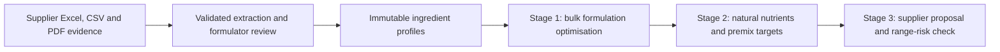

# Hi, I'm Charlie Qi 👋

Master of Computer Science graduate specialising in AI, with 10 years of biotech and nutrition product R&D experience. I build full-stack software that turns complex, evidence-heavy workflows into practical and auditable decision tools.

## ⭐ Flagship build: Integrated Nutrition Formulation Optimisation

### [View the source repository →](https://github.com/Charlie-Qi394/integrated-formulation-optimisation-tool)

> A production-style React and FastAPI platform for reviewed nutrient-data ingestion, constrained formulation optimisation, deterministic specification fit and vitamin/mineral premix design.

This project connects my software engineering work directly with my formulation domain experience:

- Imports supplier Excel, CSV and digital PDF nutrient evidence with source traceability and mandatory formulator review.
- Uses SciPy/HiGHS to optimise bulk ingredients against hard macronutrient and formulation-ratio constraints.
- Calculates natural micronutrient contributions, base-powder premix gaps and dilution-adjusted fortification targets.
- Reconciles supplier-revised premix proposals against the original product specification and makes boundary risk visible.
- Provides immutable versions, audit history, Excel/PDF exports and a Docker Compose deployment using PostgreSQL, Celery, Redis and Caddy.

## About me

- 🎓 **Master of Computer Science, AI Specialisation — Monash University:** High Distinction average; first in class in Machine Learning, Computer Vision and Applied Practice 1.
- 🧪 **Domain advantage:** 10 years across infant formula, nutrition product R&D, manufacturing, technical management and healthcare nutrition.
- 🚀 **Current focus:** Python and TypeScript applications, optimisation, AI document extraction, MCP tools, RAG workflows, PostgreSQL and practical automation.
- 💡 **How I work:** Requirements discovery, validation, traceability, technical documentation and cross-functional problem solving.

## Technical skills

| Domain | Technologies and frameworks |
| :--- | :--- |
| **Languages** | Python, TypeScript, JavaScript, SQL, HTML/CSS, VBA |
| **Software / Full-stack** | FastAPI, React, Node.js, Express, REST APIs, Celery, Redis, Prisma, pytest / Vitest |
| **Data / Optimisation** | PostgreSQL, pgvector, SQLAlchemy, SciPy/HiGHS, pandas, NumPy, relational and mass-balance modelling |
| **AI / Extraction / RAG** | Gemini structured extraction, MCP, LangGraph, vector search, grounded generation, citations |
| **ML / NLP / CV** | PyTorch, TensorFlow / Keras, scikit-learn, CNNs, LSTMs, Seq2Seq + Attention |
| **DevOps / Security** | Docker Compose, Caddy, GitHub Actions, audit logging, PKI, X.509, RSA, AES |

## More featured projects

### 🤖 [CareOps AI — MCP-Powered Aged Care Operations Assistant](https://github.com/Charlie-Qi394/careops-ai)

**TypeScript · Node.js · React · PostgreSQL · Prisma · MCP · Docker**

Production-style AI operations platform with secure MCP tools, role-based access control, schema validation, confirmation-gated writes and structured audit logs.

### 📚 [AI Regulatory Knowledge Assistant](https://github.com/Charlie-Qi394/ai-regulatory-knowledge-assistant)

**Python · FastAPI · Streamlit · PostgreSQL/pgvector · LangGraph · Docker**

Document-grounded RAG assistant with PDF/TXT/DOCX ingestion, embeddings, vector retrieval, citations, query history and evaluation workflows.

### 🥦 [FridgePeace — Shared-Household Food Management PWA](https://github.com/Charlie-Qi394/fridgepeace-portfolio)

**React · Tailwind CSS · FastAPI · SQLAlchemy · SQLite · Gemini**

Shared-household food-management PWA with pantry workflows, expiry tracking and AI-supported receipt/item scanning.

### 🔐 [Python PKI Certificate System](https://github.com/Charlie-Qi394/pki-certificate-system-python)

**Python · cryptography · X.509**

Educational PKI simulator covering certificate authorities, encrypted requests, chain validation and certificate revocation.

## Let's connect

- **Portfolio:** [charlie-qi394.github.io/charlie-qi-portfolio](https://charlie-qi394.github.io/charlie-qi-portfolio/)
- **Email:** [charlieqi2017@gmail.com](mailto:charlieqi2017@gmail.com)
- **GitHub:** [@Charlie-Qi394](https://github.com/Charlie-Qi394)
